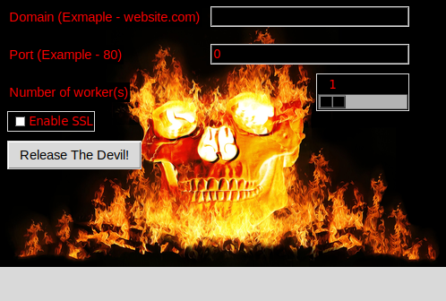

# TakeitDown
A simple ***HTTP flooder with both GUI and Command Line interface** and **SSL enable option(This tool can attack on HTTPS not just HTTP) with low system resource consuming.*** * This tool can take down most small webistes and webapps in seconds or minutes!  And slow down some websites and webapps *

# Picture of GUI interface


# Command Line Interface
```
 _____     _          _ _         _                     _ 
|_   _|_ _| | _____  (_) |_    __| | _____      ___ __ | |
  | |/ _` | |/ / _ \ | | __|  / _` |/ _ \ \ /\ / / '_ \| |
  | | (_| |   <  __/ | | |_  | (_| | (_) \ V  V /| | | |_|
  |_|\__,_|_|\_\___| |_|\__|  \__,_|\___/ \_/\_/ |_| |_(_)
                                                          

----Usages----
./takeitdown.py targetwebsite.com 80
./takeitdown.py targetwebsite.com 80 --w 500
./takeitdown.py targetwebsite.com 443 ssl
./takeitdown.py targetwebsite.com 443 ssl showstatus

[ Options ]
--w <500> - Numbers of workers/threads [Default - 500]
--p </> - File Path To Dos [Default is /]
ssl - Enable ssl connection (To attack https)
showstatus - Show HTTP response status in each request

```
